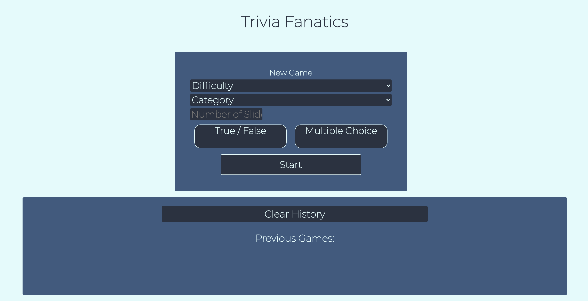
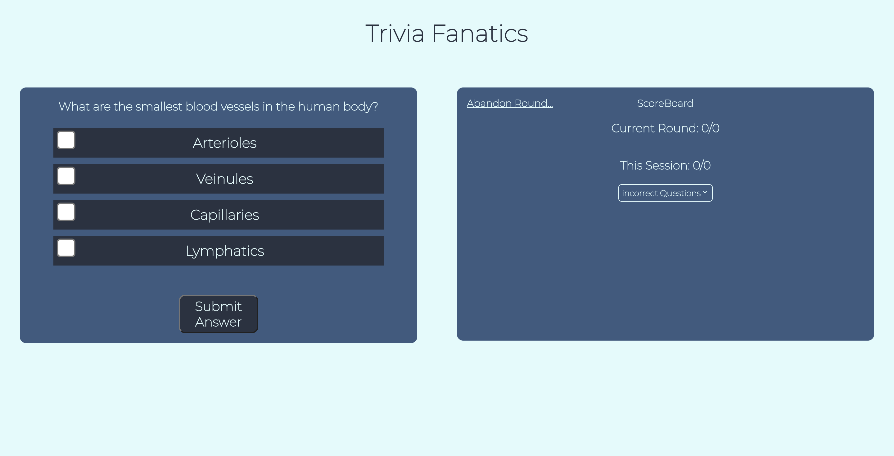
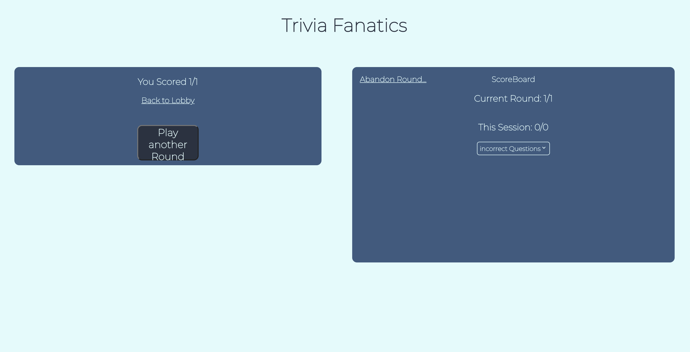

# Trivia Fanatics

## Jackson McGuire 

[][linkedin2]
[][github2]

<!--Personal Definitions -->
[linkedin2]: https://www.linkedin.com/in/jackson-m-66297b204/
[github2]: https://github.com/Jacksonmcguire

## Deployed Site

[Trivia App]()

### Learning Goals:
 * Build an app with a niche audience in mind
 * Continue gaining familiarity with React / Cypress / Router
#### Wins:
 * Gained confidence with React / Cypress / Router
 * Gained a lot of confidence with React hooks
 * Succesfully changed the MVP midway through and acheived the updated MVP
#### Challenges:
 * Pivoting MVP structure midway through / Working with socket io (Before Pivot)
 * Implementing useEffect correctly
 * Relearning LocalStorage

## Overview of Site:
##### Trivia Fanatics is a web app that allows a trivia FANATIC to:
  * Generate a set of trivia questions from filter parameters
  * Play a single player trivia game with those generated questions
  * See their score for, the current round, current game, and past games
  * Play multiple rounds in a row with the same filter parameters to improve on their weaker categories
  * When playing multiple rounds, a player will only see a question again if they got it wrong the first time

### Screenshots / Screen Recordings
#### Lobby Homepage:

#### In Game page:

#### End Game page:

### Technologies Used:
* 
* 
* 
* 
* 
* 
* 

## Setup
* To access the site on your local machine:
  * Clone down the repo through the command line
  * Run `$npm install` to install dependencies
  * Run `$npm start` to open the page on a local browser
* Otherwise the site is deployed and accessible [here]() 

## Running Tests
* After completing the setup steps above:
  * Run `$npx cypress open` to open up the test suite
  * From there click on the `trivia-test` file to open it in your browser and watch the tests run automatically
